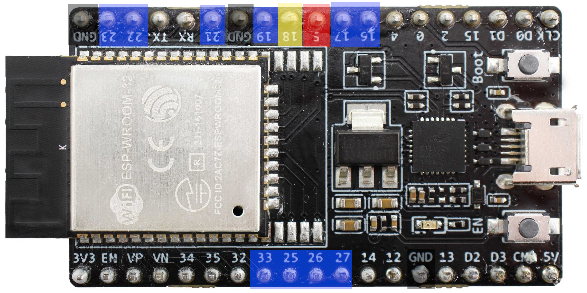

# Hardware Challenge

Creator: [jorrit](https://github.com/darkcores)

Flag format: **UHCTF{}**

## Description

We managed to extract this device, and some pieces of documentation. We also found the firmware image, but it's encrypted, so we can't reverse engineer it. Can you uncover its secrets?

## Documentation

All pins used have internal pullups enabled, meaning they ONLY need to be connected to ground (GND). For the buzzer this is PIN -> BUZZER -> GROUND. So each pin is only connected to GND or nothing (with the exception for the buzzer).

Default password is: <!-- `password123` -->

### Pin reference


| NAME | PIN NUMBER | COLOR | NOTES |
|------|------------|-------|-------|
| BUZZER | 18 | Yellow | |
| MAINTENANCE_MODE | 5 | Red | DISABLE IN PRODUCTION! |
| KEYPAD_PINS | Blue | 16, 17, 19, 21, 22, 23, 25, 26, 27, 33 |  |
| GND | NA | Black | There are 3 ground pins



### Install firmware

1. Download and install [esptool.py](https://github.com/espressif/esptool).
2. Download the attached image, and make sure you're in the same directory.
3. Install the firmware (replace `/dev/ttyUSB0` with your device address, eg `COM1` on windows):

```bash
flags='--chip esp32 --port /dev/ttyUSB0 --baud 460800 --before default_reset --after hard_reset write_flash -z --flash_mode dio --flash_freq 40m --flash_size detect'
esptool.py $flags 0x1000 image.bin
```

Or without the extras, you can try (replace `/dev/ttyUSB0`) but this wil run a bit slower:

```bash
python -m esptool --chip esp32 --port /dev/ttyUSB0 write_flash 0x1000 image.bin
```

Note: on windows you might need to install [this driver](https://www.silabs.com/developers/usb-to-uart-bridge-vcp-drivers)

## Attachments
* [firmware](attachments/image.bin)