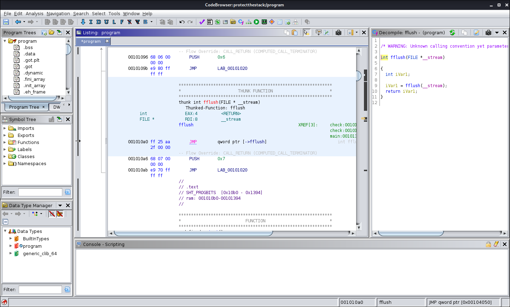

# Protect The Stack!

To solve this challenge, a few tools are recommended.

- Decompiler, we recommend Ghidra SRE (free) for this challenge, IDA
  Pro (paid) is also a good choice. This guide is written for Ghidra.
- Python (or any other scripting language)

Of course you could also use different options, we recommend running
these in Kali Linux.

## Reconnaissance

If you like, you can connect to the server with netcat or telnet, and
try to enter some passwords. Keep in mind that brute force attacks are
not allowed.

You should have a copy of the binary that is running on the server,
the IP, and port of the server.

## What is an overflow?

In information security and programming, a buffer overflow, or buffer
overrun, is an anomaly where a program, while writing data to a
buffer, overruns the buffer's boundary and overwrites adjacent memory
locations (from wikipedia). So we need to look for something in this
program, where we can write something that is larger than the buffer
it is written to.

[wikipedia buffer overflow](https://en.wikipedia.org/wiki/Buffer_overflow)

[wikipedia stack overflow](https://en.wikipedia.org/wiki/Stack_overflow)

Typically, to test if such an exploit exists an attacker sends different 
string lengths to a program and if it responds unusually or crashes they
know there could be an exploit with this string.

## Reverse engineering

You should have downloaded, and opened Ghidra. Create a new
(non-shared) project and import the server binary. Next double click
on the program in Ghidra to open the codebrowser. If you open a binary
for the first time, it asks if it should analyze the binary, this is
necessary to get C-like code instead of just assembly which is a lot
easier to work with.



You should see something similar to this screenshot. The center
listing windows shows the assembly instruction. The window on the
right side shows the reassembled code. The green areas on the right
side of the listing window show indicate which areas in assembly are
functions, or code that has been reassembled. These are the sections
we are interested in for this challenge. Luckily the programmers
forgot to turn off debugging symbols in the compiler, which makes out
work a lot easier.

Try to look at the program to see what it does, the `check` function
seems especially interesting for an overflow. Luckily with ghidra this
is as easy as just clicking around in the assembly code.

## What to look for

In this particular case, we look for the local variables in the `check`
function. The `password` variable is not the same size as the `fgets` 
function reads. This allows us to overwrite other variables in the 
program, specifically `debug_flags`. It is up to you to find the real 
password using these variables.

You can run this program locally on linux with `./protectthestack`. It
can also be useful to debug this program with `gdb`, although this is 
not necessary to solve this challenge. The decompiled `check` function 
should give all the necessary information to construct a payload.

## The payload

To exploit this program, you need to send certain values to the
server. To make this a lot easier, it is a good idea to use a python
script. A script like this Python3 can be used, of course you still
need to create your own payload.

```python3
import socket

HOST='127.0.0.1'
PORT=1337
with socket.socket(socket.AF_INET, socket.SOCK_STREAM) as s:
    s.connect((HOST, PORT))
    payload = bytearray(b'Hello World\n')
    data = s.recv(1024)
    s.sendall(payload)
    data = s.recv(1024)
    print("Response: %s" % data)
```

With a correct payload, you should get the password in the
response. This password should give you access to the flag.
